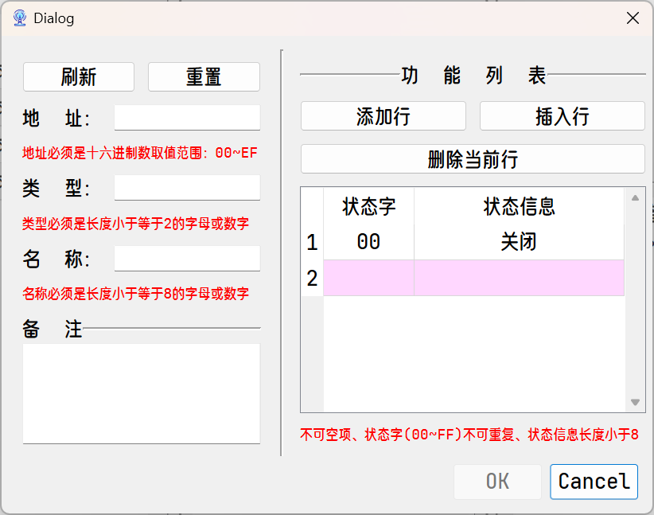

# 目录 <!-- omit in toc -->

- [软件环境](#软件环境)
- [硬件设备](#硬件设备)
  - [硬件连接](#硬件连接)
- [软件介绍](#软件介绍)
- [单片机编译操作](#单片机编译操作)
  - [主机 Host](#主机-host)
  - [从机 Slave](#从机-slave)

# 软件环境

- proteus 8.6
- keil uVision5
- Qt 6.5.3

# 硬件设备

- stc12c5a60s2 （主机）
- stc89c52rc （从机）
- KQ330 （电力载波通信）

## 硬件连接

# 软件介绍

软件界面模块

右侧功能列表内置了通信协议，通过按键可简单控制从机状态；同时可以在左侧查看当前未处理的事件、指令。

左侧串口功能模块

可以在控制界面对从机的信息以及，相应的功能状态进行：增删改查。

# 单片机编译操作

## 主机 Host

通常主机除了引脚不需要进行申明改动

Host 项目目录为：`./proj/keil_host_c`
目录：`./proj/keil_host_a` 和 `./proj/keil_host_b` ，为开发测试遗留，请忽略。

主机串口引脚相关信息请修改在 `./proj/keil_host_c/__config__.h` 中定义的宏
若需要修改主机对从机的等待时间请在 `./proj/keil_host_c/main.c` 中修改宏

## 从机 Slave

从机需要根据项目需求进行更改，为了尽可能的减少需要修改的内容，我将从机部分的操作抽象了4个接口

- `#define THIS_ADDR`: 需要定义当前从机的地址码
- `void FuncInit(void)`: 最早的初始化，早于定时器和串口（防止初始化影响串口正常通信），例如：lcd等模块的初始化
- `void Func(void)`: 用来定义从机主循环的行为
- `bit updateState(unsigned char word)`: 用来更改从机状态（利用中断），返回是否更改成功

因此仅需要在 `./proj/keil_slave/slaves.h`
 中修改或定义其接口，即可实现不同功能的从机

